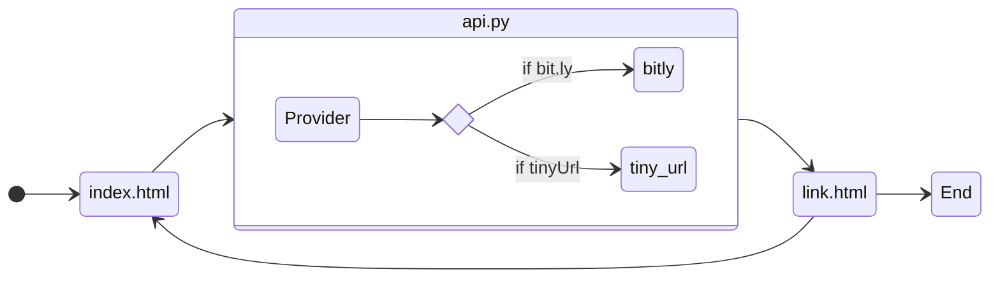

Design Choice
======================
I followed the following design for the given task:




The request from the landing page (index.html) goes to the custom API (api.py), where it checks the provider to use their API in order to create a short link. Once shortlink is created it is then passed onto a new page (link.html). The link.html page displays the Http status code and description, a raw response (below) and the same response again for usuability.
```json
{
    "url": "https://example.com",
    "link": "https://bit.ly/8h1bka"
}
``` 

Sample Result
=================


https://user-images.githubusercontent.com/81873220/167933693-1bad395f-36eb-4f8c-90c8-2d3f7fd26f73.mp4


Fallbacks stratergies
======================
1. When No provider is selected, I have chosen Bit.ly by default.

2. If the provider fails to create a short URL (either due to invalid URL or problem with the provider's API) a response with 'URL Method failed' is returned for now.

Future improvements
===================

1. The functions ingesting the provider's API call can be placed in another file to provide more abstraction. For the time being, abstraction is attained by creating separate function calls for bit.ly and tiny_url
2. In future, a database can be connected to store the newly link data, so that we are not required to use the provider's API everytime.
